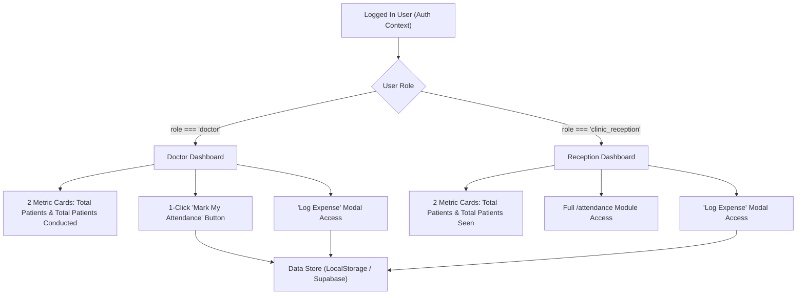

# Dashboard Role Simplification, Attendance Restrictions & Expense Logging Design Spec

**Date**: September 29, 2026  
**Target Features**: Doctor Dashboard, Reception Dashboard, Role-Based Attendance Access, Expense Logging  
**Repository**: `PhysioBilldesk` (`d:\PhysioBilldesk`)  

---

## 1. Overview & Objectives

Simplify the user interface for both **Doctor** and **Clinic Reception** roles while hardening access control and clinic operational tools:
- Show strictly **2 metrics** on the dashboard for both roles: **Total Patients** and **Total Patients Seen**.
- Restrict full `/attendance` management to **Clinic Reception** (and Admin). Restrict **Doctors** from full `/attendance` page access, but empower each doctor to **Mark Their Own Attendance** via a 1-click action directly on their Doctor Dashboard.
- Enable full **Clinic Expense Logging** access for both **Reception** and **Doctor** users, ensuring accurate clinic branch binding (`centre_id`) and immediate state synchronization.

---

## 2. Detailed Role Specifications

### 2.1 Doctor Role (`role === 'doctor'`)
* **Dashboard Path**: `/dashboard`
* **Metrics Cards**:
  1. `Total Patients`: Count of registered patients assigned to this doctor (or registered with primary doctor ID).
  2. `Total Patients Seen`: Count of visits/consultations conducted by this doctor.
* **Attendance Behavior**:
  * Cannot access full `/attendance` page (route guard redirects doctors to `/dashboard`).
  * Dedicated **"Mark My Attendance"** button on the Doctor Dashboard allowing doctors to log their present/absent state for today.
* **Expense Logging**:
  * Has access to **"Log Expense"** modal on their dashboard to record medical supplies, maintenance, or clinic expenses.

### 2.2 Clinic Reception Role (`role === 'clinic_reception'`)
* **Dashboard Path**: `/dashboard`
* **Metrics Cards**:
  1. `Total Patients`: Count of registered patients at their clinic branch (`centre_id`).
  2. `Total Patients Seen`: Count of total visits conducted at their clinic branch (`centre_id`).
* **Attendance Behavior**:
  * Has **full access** to `/attendance` module to view, mark, filter, and export staff and doctor attendance records for their clinic branch.
* **Expense Logging**:
  * Has access to **"Log Expense"** modal, auto-binding the expense to their assigned `centre_id` with instant local state update.

---

## 3. Data Flow & Architecture

---

## 4. Route Protection & Guards

- **`/attendance` Page**:
  - `admin`: Full access (Global / All Centres filter).
  - `clinic_reception`: Full access (Scoped to user's `centreId`).
  - `doctor`: Access denied -> Redirected to `/dashboard` with toast message: `"Doctors can mark attendance directly from their dashboard."`

---

## 5. Verification Checkpoints

1. Compile check (`npx tsc --noEmit`) returns 0 type errors.
2. Build check (`npm run build`) completes cleanly across all static & dynamic routes.
3. Login verification across accounts (`dr.sarah@physionautics.com`, `nfc@physionautics.com`).
