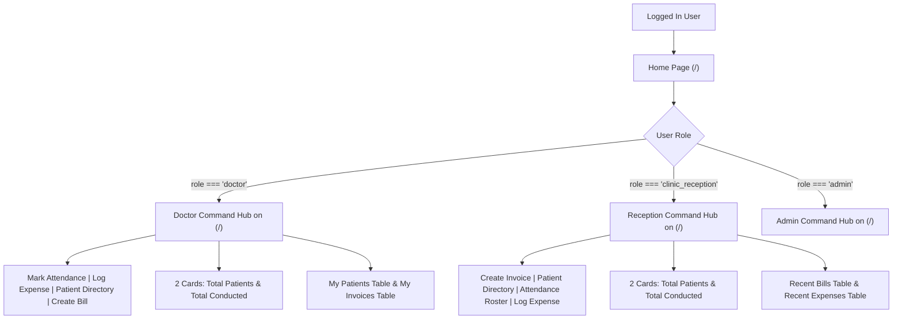

# Unified Home Command Hub Design Spec (Eliminating Separate /dashboard Route)

**Date**: September 29, 2026  
**Target Feature**: Unified Authenticated Home Page (`app/(auth)/page.tsx`), Route Redirects (`/dashboard` -> `/`)  
**Repository**: `PhysioBilldesk` (`d:\PhysioBilldesk`)  

---

## 1. Executive Summary & Vision

Eliminate the redundant `/dashboard` page and transform the main home screen (`/` at `app/(auth)/page.tsx`) into a role-adaptive **Command Hub**. When users log in, they land directly on `/` with all role-specific metrics, quick actions, attendance tools, expense logging, and patient/invoice tables presented immediately without extra navigation.

---

## 2. Role-Adaptive Home Hub Specifications (`/`)

### 2.1 Doctor Role (`role === 'doctor'`)
* **Header Actions**:
  1. `Mark My Attendance` (1-click attendance check-in for today)
  2. `Log Expense` (Opens `ExpenseLoggingModal`)
  3. `Patient Directory` (`/patients`)
  4. `Create Bill` (`/billing`)
* **Metric Cards (Exactly 2)**:
  1. `Total Patients`: Assigned primary patients count.
  2. `Total Patients Conducted`: Consultations/visits conducted count.
* **Direct Content Sections**:
  * My Patients Directory & Search
  * My Recent Clinical Invoices & Consultation History

### 2.2 Clinic Reception Role (`role === 'clinic_reception'`)
* **Header Actions**:
  1. `Create Invoice` (`/billing`)
  2. `Patient Directory` (`/patients`)
  3. `Attendance Roster` (`/attendance`)
  4. `Log Expense` (Opens `ExpenseLoggingModal`)
* **Metric Cards (Exactly 2)**:
  1. `Total Patients`: Total registered clinic patients count.
  2. `Total Patients Conducted`: Total clinic visits conducted count.
* **Direct Content Sections**:
  * Front Desk Patient Counter / Recent Bills
  * Recent Clinic Expenses Logged

### 2.3 Route Protection & Redirects
* Redirect `/dashboard` to `/`.
* Doctor accessing `/attendance` -> Toast notification & redirect to `/`.

---

## 3. Architecture

